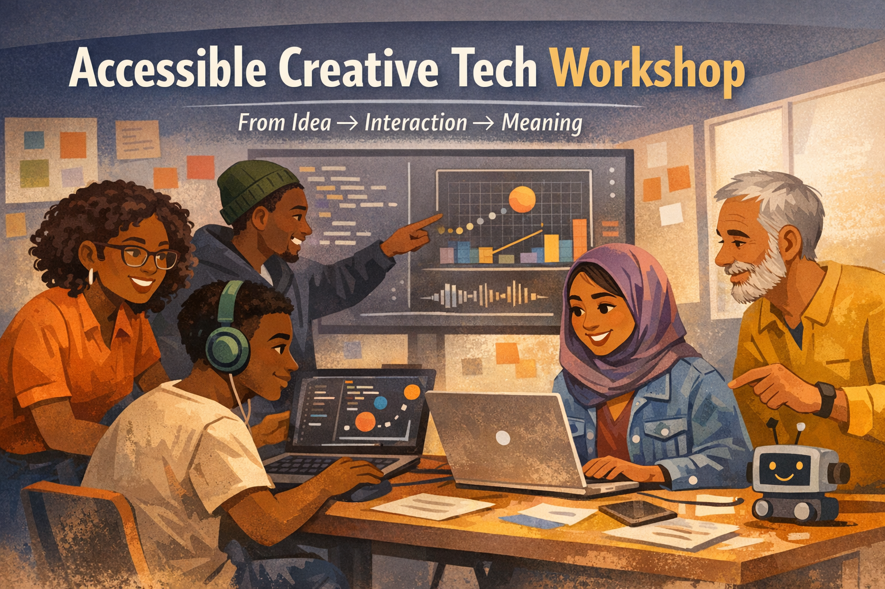
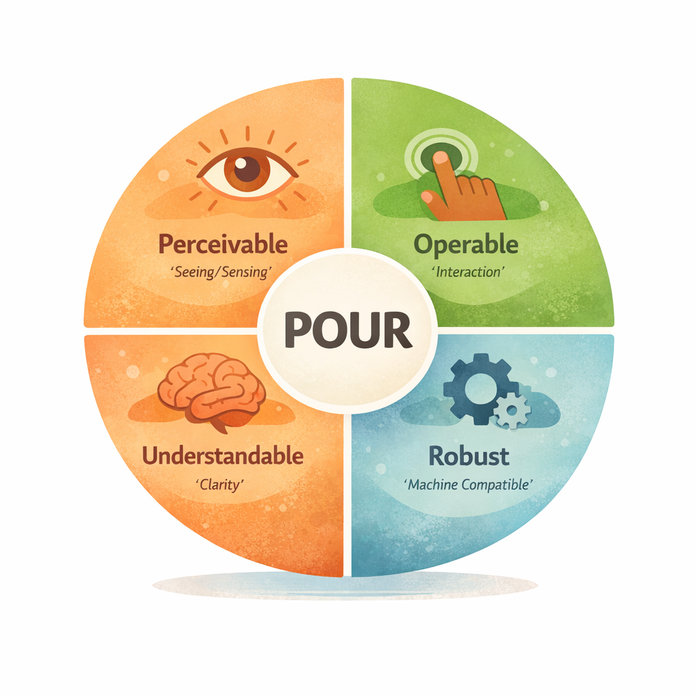

# Accessible by Design: Prototyping Meaning, Not Just Interfaces

> A hands-on workshop on creating simple prototypes and improving them so they are easier to understand, use, and interpret by different people and systems.

---

## Table of Contents

- [What is Digital Accessibility?](#what-is-digital-accessibility)
- [Accessibility Primer](#accessibility-primer)
- [How Content Should Work](#how-content-should-work)
- [Understanding POUR](#understanding-pour)
  - [POUR and Storytelling](#pour-and-storytelling)
  - [Why POUR Matters](#why-pour-matters)
- [Overview](#overview)
- [Core Idea](#core-idea)
- [Thinking in Objects](#thinking-in-objects)
- [Example: Expressing Intent in Code](#example-expressing-intent-in-code)
- [Working with Multiple Elements](#working-with-multiple-elements)
- [Workshop Flow](#workshop-flow)
  - [Discussion](#discussion)
  - [Play (Sketching + Imagination)](#play-sketching--imagination)
- [Example Interaction](#example-interaction)
- [Making Things Easier to Understand and Use](#making-things-easier-to-understand-and-use)
- [Reflection](#reflection)
- [Extend Your Prototype](#extend-your-prototype)
- [Why This Matters](#why-this-matters)

---

## What is Digital Accessibility?



Digital accessibility is about designing systems so that more people—and more systems—can use and understand them.  
It means considering different abilities, contexts, and ways of interacting from the very beginning.

This includes people:
- with different physical, sensory, or cognitive abilities  
- using different devices or environments  
- using assistive technologies such as screen readers or keyboard navigation  

It also includes how systems are interpreted by:
- browsers and user agents  
- search systems  
- AI and machine learning tools  

> Can this be understood and used without unnecessary barriers?

---

## Accessibility Primer

Accessibility is not something added at the end.

It begins with clarity.

If someone—or something—has to guess:
- what your system does  
- how to use it  
- what is happening  

then it becomes harder to use.

> Accessibility = making intent clear from the start

---

## How Content Should Work

Content should be:
- perceivable  
- operable  
- understandable  
- robust  

This means it should not depend on a single way of seeing, using, or interpreting it.

---

## Understanding POUR



POUR stands for:
- Perceivable  
- Operable  
- Understandable  
- Robust  

---

### POUR and Storytelling

Think of this like storytelling:

- Who  
- What  
- Where  
- When  
- Why / How  

POUR does the same for systems:

- Perceivable → what is happening  
- Operable → how to use it  
- Understandable → does it make sense  
- Robust → can it work across systems  

---

### Why POUR Matters

POUR helps move from:
> something that works → something that can be understood and used

Learn more:  
https://www.w3.org/WAI/standards-guidelines/wcag/

---

## Overview

This workshop is about prototyping with intention.

You will create a simple prototype and make it clearer:

- what it is  
- what it does  
- how someone interacts with it  

---

## Core Idea

Make → clarify → expand

---

## Thinking in Objects

Think of what you are building as an object:

- What is it?  
- What does it do?  
- How do you use it?  

---

## Example: Expressing Intent in Code

```javascript
let interactiveObject = {
  name: "movable circle",
  role: "interactive visual element",
  description:
    "A circle that can be moved using keyboard or pointer input.",
  instructions:
    "Use arrow keys or click and drag to move the circle.",
  accessibilitySummary:
    "Supports multiple input methods, provides clear instructions, and gives visual feedback."
};
