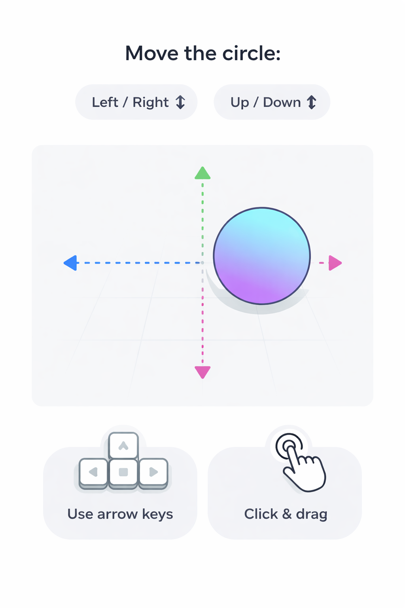

# 🌍 Accessible by Design  
## Prototyping Meaning, Not Just Interfaces

> A hands-on workshop on creating simple prototypes and improving them so they are easier to understand, use, and interpret by different people and systems.

---

## 🧭 Accessibility Primer

Accessibility begins with clarity.

If someone—or something—has to guess:
- what your system does  
- how to use it  
- what is happening  

then it becomes harder to use.

In this workshop, accessibility means:

> making your intent clear from the start

---

## 🧠 A Simple Check

As you build, ask:

- Can someone **sense** what’s happening?  
- Can someone **use** it?  
- Does it **make sense**?  
- Could another system understand it?  

These come from accessibility thinking (POUR), used here as simple design checks.

Learn more:
- https://www.w3.org/WAI/standards-guidelines/wcag/

---

## 🧠 Overview

This workshop is about prototyping with intention.

You will create a simple prototype and improve it by making it clearer:

- what it is  
- what it does  
- how someone interacts with it  

---

## 🎯 Core Idea

A prototype becomes more useful as its intent becomes clearer.

Make → clarify → expand.

---

## 🧱 Thinking in Objects

Think of what you are building as an object with a purpose.

- What is it?  
- What does it do?  
- How do you use it?  

When these are clear, your prototype becomes easier to understand and use.

---

## 🔧 What We Will Do

During the workshop, you will:

- create a small interactive prototype  
- define what your object does  
- make interaction visible and understandable  
- refine your work so others can use it more easily  

You can use any medium:
- code  
- web tools  
- sketches  
- or simple materials  

The focus is on **clarity**, not complexity.

---

## 🧪 Example Interaction

An example prototype where a visual element responds to input, demonstrating clear feedback and simple instructions.

---

## 🧭 Making Things Easier to Understand and Use

As you build, ask:

- What does this do?  
- How does someone know how to use it?  
- Does it respond clearly?  
- Can it be used in more than one way?  
- Could someone—or something else—figure it out?  

Don’t make people guess.

---

## ✍🏾 Reflection

Describe your prototype in one sentence:

> This system allows a user to ______ by ______.

Then consider:

- Would someone understand this without explanation?  
- Could it be used differently?  
- Could another system interpret what it does?  

---

## 🌱 Extend Your Prototype

You can improve your prototype by:

- adding clearer instructions  
- supporting different ways of interacting  
- simplifying how it works  
- designing for a specific person or context  

---

## 🌍 Why This Matters

When your intent is clear:

- your work becomes easier to understand  
- more people can use it  
- it adapts better across contexts  
- it becomes easier for systems and tools to interpret  

Accessible design begins with clarity.

---

## 🤝 Credits

Workshop by  
Adekemi (Kemi) Hanna Sijuwade-Ukadike  
Creative technologist, artist, and systems builder  

---

## 📌 License

MIT License (or update as needed)
